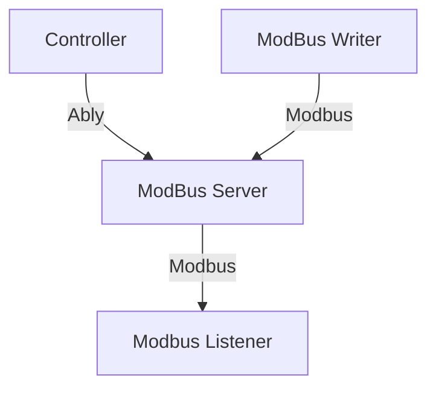

# modbus-test
A modbus test


## Project connections


### Project setup

On each directory: 
```
npm install
```

### Run the code

First you need to run  the server in `modbus-server/`:
```
node index.js
```

If you want to follow the register update you have to run the litsener in `modbus-listener/`:
```
node index.js
```
You can update the register once with the writer in `modbus-writer/`:
```
node index.js
```
Or you can use the controller to update the register with an interface in `modbu-controller/`:
```
npm run dev
```
